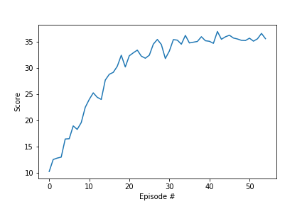
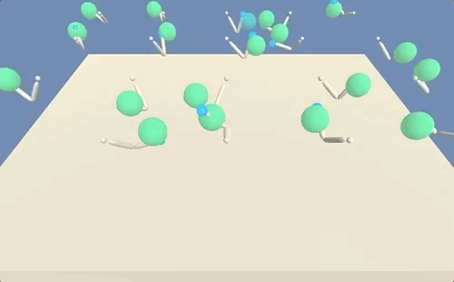

# Reinforcement Learning Continuous Control Report:

## Method Description:
Architecture of the algorithm:
We used Deep Deterministic Policy Gradient

### Algorithm Description:
Randomly initialize critic and actor networks
Initialize replay buffer R
Loop over episodes
  Initialize a random process N for action exploration
  Receive initial observation state
  Loop over steps:
    Select action according to the current policy and exploration noise
    Execute action at and observe reward
    Store transition
    Sample a random minibatch
    Update critic
    Update actor
    Update target network

### Hyperparameters Used
BUFFER_SIZE = int(1e5)  # replay buffer size
BATCH_SIZE = 128        # minibatch size
GAMMA = 0.99            # discount factor
TAU = 1e-3              # for soft update of target parameters
LR_ACTOR = 1e-4         # learning rate of the actor
LR_CRITIC = 1e-4        # learning rate of the critic
WEIGHT_DECAY = 0        # L2 weight decay
N_EPISODES = 1000

### All four networks structure: two hidden layers with size (256, 128)
fc1_units = 256
fc2_units = 128

### Results of the analysis:
Episode 0	Average Score: 10.22  
Episode 1	Average Score: 11.36  
Episode 2	Average Score: 11.84  
Episode 3	Average Score: 12.12  
Episode 4	Average Score: 12.98  
Episode 5	Average Score: 13.56  
Episode 6	Average Score: 14.33  
Episode 7	Average Score: 14.82  
Episode 8	Average Score: 15.35  
Episode 9	Average Score: 16.06  
Episode 10	Average Score: 16.78  
Episode 11	Average Score: 17.49  
Episode 12	Average Score: 18.02  
Episode 13	Average Score: 18.45  
Episode 14	Average Score: 19.06  
Episode 15	Average Score: 19.67  
Episode 16	Average Score: 20.23  
Episode 17	Average Score: 20.79  
Episode 18	Average Score: 21.40  
Episode 19	Average Score: 21.84  
Episode 20	Average Score: 22.34  
Episode 21	Average Score: 22.82  
Episode 22	Average Score: 23.28  
Episode 23	Average Score: 23.66  
Episode 24	Average Score: 23.98  
Episode 25	Average Score: 24.31  
Episode 26	Average Score: 24.69  
Episode 27	Average Score: 25.07  
Episode 28	Average Score: 25.40  
Episode 29	Average Score: 25.61  
Episode 30	Average Score: 25.86  
Episode 31	Average Score: 26.16  
Episode 32	Average Score: 26.43  
Episode 33	Average Score: 26.67  
Episode 34	Average Score: 26.94  
Episode 35	Average Score: 27.16  
Episode 36	Average Score: 27.37  
Episode 37	Average Score: 27.57  
Episode 38	Average Score: 27.79  
Episode 39	Average Score: 27.98  
Episode 40	Average Score: 28.15  
Episode 41	Average Score: 28.31  
Episode 42	Average Score: 28.51  
Episode 43	Average Score: 28.67  
Episode 44	Average Score: 28.83  
Episode 45	Average Score: 28.99  
Episode 46	Average Score: 29.13  
Episode 47	Average Score: 29.27  
Episode 48	Average Score: 29.39  
Episode 49	Average Score: 29.51  
Episode 50	Average Score: 29.63  
Episode 51	Average Score: 29.73  
Episode 52	Average Score: 29.84  
Episode 53	Average Score: 29.97  
Episode 54	Average Score: 30.07  

Environment solved in 53 episodes!	Average Score: 30.07  

  

  

### Future next steps:
While we are able to achieve the target goal, it took 53 episodes till convergence. Distributed Distributional Deep Deterministic Policy Gradient algorithm, D4PG, through N-step returns and prioritized experience replay might offer a faster algorithm to achieve convergence and would be our next future plan for this project.

### References:
1. Mnih V, Puigdomènech Badia A, Mirza M, et al. Asynchronous Methods for Deep Reinforcement Learning.; 2016. https://arxiv.org/pdf/1602.01783.pdf. Accessed April 15, 2019.

2. Barth-Maron G, Hoffman MW, Budden D, et al. Distributed Distributional Deterministic Policy Gradients. 2018:1-16. http://arxiv.org/abs/1804.08617.

3. Rudy Gilman. Intuitive RL: Intro to Advantage-Actor-Critic (A2C). https://hackernoon.com/intuitive-rl-intro-to-advantage-actor-critic-a2c-4ff545978752. Accessed May 5, 2019.

4. Arthur Juliani. Simple Reinforcement Learning with Tensorflow Part 8: Asynchronous Actor-Critic Agents (A3C). https://medium.com/emergent-future/simple-reinforcement-learning-with-tensorflow-part-8-asynchronous-actor-critic-agents-a3c-c88f72a5e9f2. Accessed May 5, 2019.
